Trabajo en grupo 2015 (Datos AEMET)
===================================

Probablemente lo más complejo del trabajo es pensar un modelo para
almacenar la predicción. Esta propuesta de solución asume que las
predicciones se almacenan como una lista de ``PrediccionMunicipio``. La
clase ``PrediccionMunicipio`` contiene todos los datos disponibles en el
XML.

Como siempre utilizaremos diseño *top-down*. Antes de diseñar
``PrediccionMunicipio`` vamos a resolver el problema y lo que
necesitemos lo iremos usando como si ya estuviera disponible. No se
llega a esta solución de una vez. Es un proceso iterativo en el que se
va añadiendo la funcionalidad poco a poco. Pero cuidado, eso no
significa que diseñamos *bottom-up*. Implementamos la solución al
problema solo que de manera reducida o incluso incompleta.

.. code:: python

    %matplotlib inline
    
    import urllib
    import lxml.etree as ET
    import matplotlib.pyplot as plt
    
    class PrediccionAEMET(object):
        def __init__(self):
            self._provinciaToId = _leerCodigosProvincias()
            self._prediccion = None
            self._provincia = None
        
        def maxTemperatura(self, provincia):
            u'''Asume provincia cadena con nombre de provincia según AEMET.
                Devuelve tupla (T, L) siendo T temperatura máxima de la predicción
                y L lista de tuplas (municipio, fecha) en la que se espera T.'''
            por_temperatura = []
            for p in self.prediccion(provincia):
                por_temperatura += zip(p.temperaturaMax(), 
                                       [p.nombre]*len(p.fechas), 
                                       p.fechas)
            por_temperatura = sorted(por_temperatura, reverse=True)
            T = por_temperatura[0][0]
            L = sorted([(p[1], p[2]) for p in por_temperatura if T == p[0]])
            return T, L
    
        def graficaSensacionTermica(self, municipio, formato):
            u'''Asume municipio, formato cadenas.
                Genera una gráfica de sensación térmica para el municipio indicado. '''
            if not self._prediccion:
                raise ValueError('No hay provincia')
            prediccion = [ p for p in self._prediccion if p.nombre == municipio ]
            if len(prediccion) < 1:
                raise ValueError('Municipio no encontrado')
            
            prediccion = prediccion[0]        
            plt.title(u'Sensación térmica en {0}'.format(prediccion.nombre), 
                      fontsize='x-large')
            plt.xlabel('Fecha')
            plt.ylabel(u'Sensación térmica (ºC)')
            plt.xticks(range(12),
                       prediccion.fechas, 
                       rotation=45)
            
            smax = plt.plot(prediccion.sensTermicaMax(), 'ro--', label=u'máxima')
            smin = plt.plot(prediccion.sensTermicaMin(), 'bo--', label=u'mínima')
            
            plt2 = plt.twiny()
            plt2.axis('off')
            plt2.set_autoscale_on(False)
            plt2.set_xlim(xmax=len(prediccion.sensTermica)-1)
            horas, por_horas = self.sensacionTermicaPorHoras(prediccion)
    
            shoras = plt2.plot(horas, por_horas, 'g^--', label=u'estimación')
            
            plt.legend(handles=smax+smin+shoras,
                       loc='upper right', 
                       shadow=True, 
                       fontsize='large')
            outfile = u'{0}_{1}.{2}'.format(prediccion.nombre, 
                                            prediccion.fechas[0], 
                                            formato)
            plt.savefig(outfile)
            print 'Almacenado archivo', outfile
            plt.show()
    
        def prediccion(self, provincia):
            u'''Asume provincia cadena con nombre de provincia según AEMET.
                Devuelve lista de predicciones diarias'''
            id_provincia = self._provinciaToId[provincia]
            if not self._prediccion or self._provincia != id_provincia:
                self._prediccion = _leerPrediccionProvincia(id_provincia)
                self._provincia = id_provincia
            return self._prediccion
        
        def sensacionTermicaPorHoras(self, prediccion):
            u'''Asume self._prediccion previamente actualizado.
                Devuelve tupla de dos listas, eje X e Y de la predicción 
                de sensación térmica por horas'''
            frac_dia = { '00': 0., '06': 0.25, '12': 0.5, '18': 0.75, '24': 1. }
            sens_horas = [ x[2] for x in prediccion.sensTermica  ]
            horas, por_horas = [], []
            for dia in range(len(sens_horas)):
                for p in sens_horas[dia]:
                    horas.append(dia + frac_dia[p[0]])
                    por_horas.append(p[1])
            return horas, por_horas

Ahora que ya sabemos qué necesitamos en ``PrediccionMunicipio`` es el
momento de implementarla.

.. code:: python

    class PrediccionMunicipio(object):
        def __init__(self, root):
            self.nombre = root.find('nombre').text
            self.fechas = [ dia.get('fecha') for dia in root.iter('dia') ]
            self.sensTermica = [ self._leerMagnitud('sens_termica', dia) for dia in root.iter('dia') ]
            self.temperatura = [ self._leerMagnitud('temperatura', dia) for dia in root.iter('dia') ]
    
        def sensTermicaMax(self):
            return [ p[0] for p in self.sensTermica ]
        
        def sensTermicaMin(self):
            return [ p[1] for p in self.sensTermica ]
    
        def temperaturaMax(self):
            return [ p[0] for p in self.temperatura ]
    
        def temperaturaMin(self):
            return [ p[1] for p in self.temperatura ]
    
        def _leerMagnitud(self, nombre, dia):
            magnitud = dia.find(nombre)
            mmax = float(magnitud.find('maxima').text)
            mmin = float(magnitud.find('minima').text)
            horas = [ (d.get('hora'), float(d.text)) for d in magnitud.iter('dato') if d.text ]
            return (mmax, mmin, horas)
        
        def __str__(self):
            return '''Prediccion ({0},
                {1}, 
                {2}, 
                {3})'''.format(self.nombre,
                               self.fechas,
                               self.sensTermica,
                               self.temperatura)

Las funciones de comunicación con la AEMET las dejo aparte de manera que
pueda probar todo lo anterior sin conexiones.

.. code:: python

    def _leerCodigosProvincias():
        u'''Devuelve un diccionario que hace corresponder el nombre de la provincia al
            código numérico correspondiente según AEMET'''
        f = urllib.urlopen('http://www.aemet.es/es/eltiempo/prediccion/municipios')
        encoding = f.headers['content-type'].split('charset=')[-1]
        root = ET.HTML(unicode(f.read(), encoding))
        provincias = root.findall(".//select[@id='provincia_selector']/option")[1:]
        return  { nombre:int(x.get('value')) for x in provincias \
                    for nombre in x.text.split('/') }
    
    def _leerPrediccionProvincia(id_provincia):
        u'''Asume provincia cadena con nombre de provincia según AEMET.
            Lee de AEMET la predicción para todos sus municipios y 
            devuelve una lista con todas las predicciones diarias.'''
        prediccion = []
        fallos = 0
        for municipio in range(1,10000):
            try: 
                prediccion.append(_leerPrediccionMunicipio(id_provincia, municipio))
                fallos = 0
            except:
                fallos += 1
            if fallos > 5: break
        return prediccion
        
    def _leerPrediccionMunicipio(id_provincia, id_municipio):
        u'''Asume id_provincia, id_municipio enteros.
            Devuelve lista de predicciones diarias para ese municipio.'''
        url = 'http://www.aemet.es/xml/municipios/localidad_{0:02d}{1:03d}.xml'
        url = url.format(id_provincia, id_municipio)
        f = urllib.urlopen(url)
        if f.getcode() != 200:
            raise ValueError('Failed ({0}) {1}'.format(f.getcode(), url))
        root = ET.fromstring(f.read())
        return PrediccionMunicipio(root)

La interfaz puede ser tan simple como se desee. En nuestro caso vamos a
usar las capacidades interactivas de IPython Notebook.

.. code:: python

    from IPython.html.widgets import interact
    
    provincias = [''] + sorted(_leerCodigosProvincias().keys())
    formatos = ['', 'png', 'pdf']
    aemet = PrediccionAEMET()
    
    @interact(provincia=provincias, formato=formatos)
    def datos_AEMET(provincia, formato):
        if not provincia: return
    
        tmax, municipios = aemet.maxTemperatura(provincia)
        print u'La máxima temperatura para los próximos días es de {0}ºC y se espera en:'.format(tmax)
        for nombre,fecha in municipios:
            print u' - {0} el día {1}'.format(nombre, fecha)
        
        if not formato: return
        print
        for nombre in set([m[0] for m in municipios]):
            aemet.graficaSensacionTermica(nombre, formato)

.. parsed-literal::

    La máxima temperatura para los próximos días es de 37.0ºC y se espera en:
     - Alameda de la Sagra el día 2016-07-10
     - Alcañizo el día 2016-07-10
     - Azután el día 2016-07-10
     - Añover de Tajo el día 2016-07-10
     - Barcience el día 2016-07-10
     - Bargas el día 2016-07-10
     - Borox el día 2016-07-10
     - Cabañas de la Sagra el día 2016-07-10
     - Calera y Chozas el día 2016-07-10
     - Camarenilla el día 2016-07-10
     - Carriches el día 2016-07-10
     - Cebolla el día 2016-07-10
     - Ciruelos el día 2016-07-10
     - Cobeja el día 2016-07-10
     - El Puente del Arzobispo el día 2016-07-10
     - Erustes el día 2016-07-10
     - Esquivias el día 2016-07-10
     - Huerta de Valdecarábanos el día 2016-07-10
     - Las Ventas de San Julián el día 2016-07-10
     - Magán el día 2016-07-10
     - Malpica de Tajo el día 2016-07-10
     - Mocejón el día 2016-07-10
     - Navalmoralejo el día 2016-07-10
     - Numancia de la Sagra el día 2016-07-10
     - Olías del Rey el día 2016-07-10
     - Ontígola el día 2016-07-10
     - Oropesa el día 2016-07-10
     - Pantoja el día 2016-07-10
     - Rielves el día 2016-07-10
     - Seseña el día 2016-07-10
     - Toledo el día 2016-07-10
     - Torralba de Oropesa el día 2016-07-10
     - Valdeverdeja el día 2016-07-10
     - Villaluenga de la Sagra el día 2016-07-10
     - Villamiel de Toledo el día 2016-07-10
     - Villamuelas el día 2016-07-10
     - Villaseca de la Sagra el día 2016-07-10
     - Villasequilla el día 2016-07-10
     - Yeles el día 2016-07-10
     - Yepes el día 2016-07-10
     - Yuncler el día 2016-07-10
     - Yunclillos el día 2016-07-10
    
    Almacenado archivo Torralba de Oropesa_2016-07-04.png

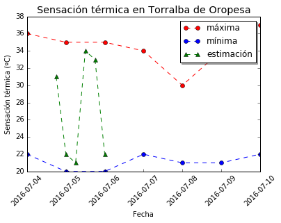

.. parsed-literal::

    Almacenado archivo Toledo_2016-07-04.png

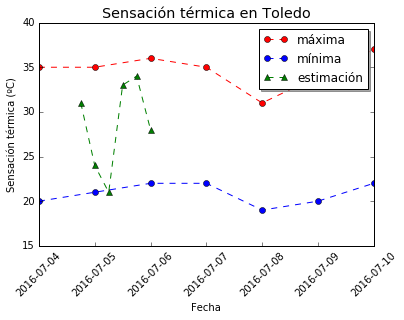

.. parsed-literal::

    Almacenado archivo Pantoja_2016-07-04.png

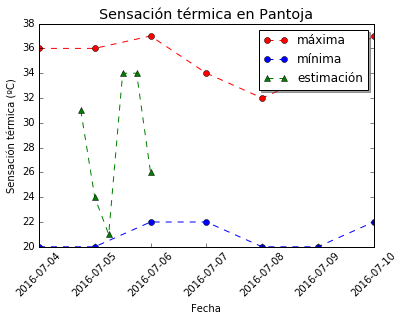

.. parsed-literal::

    Almacenado archivo Bargas_2016-07-04.png

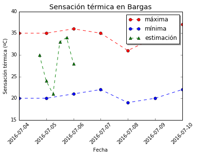

.. parsed-literal::

    Almacenado archivo Erustes_2016-07-04.png

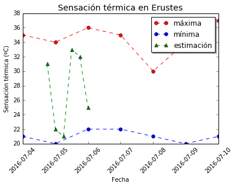

.. parsed-literal::

    Almacenado archivo Yepes_2016-07-04.png

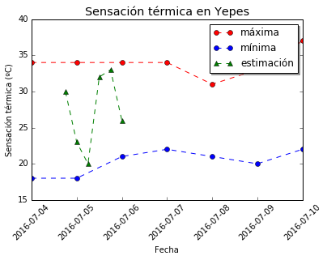

.. parsed-literal::

    Almacenado archivo Rielves_2016-07-04.png

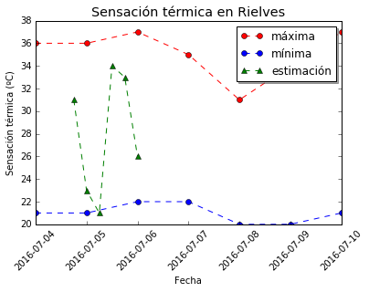

.. parsed-literal::

    Almacenado archivo Ontígola_2016-07-04.png

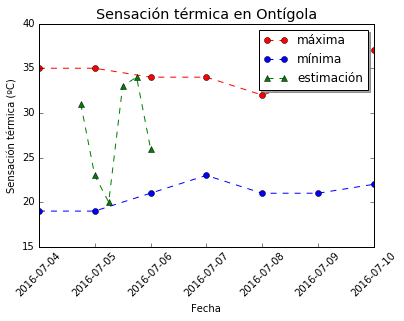

.. parsed-literal::

    Almacenado archivo Cobeja_2016-07-04.png

.. parsed-literal::

    Almacenado archivo Esquivias_2016-07-04.png

.. image:: Datos AEMET_files/Datos AEMET_7_19.png

.. parsed-literal::

    Almacenado archivo Camarenilla_2016-07-04.png

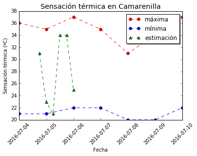

.. parsed-literal::

    Almacenado archivo Malpica de Tajo_2016-07-04.png

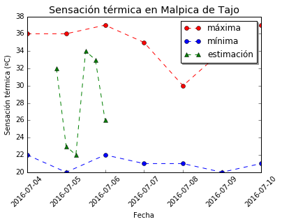

.. parsed-literal::

    Almacenado archivo Borox_2016-07-04.png

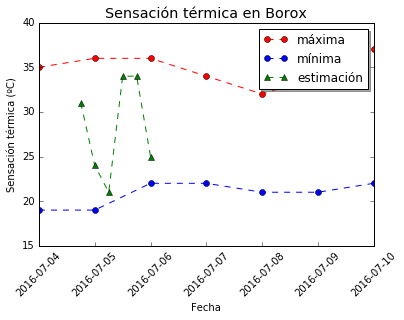

.. parsed-literal::

    Almacenado archivo Villamuelas_2016-07-04.png

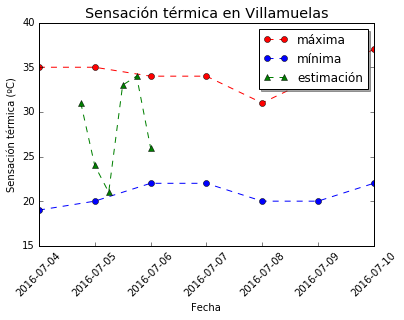

.. parsed-literal::

    Almacenado archivo Numancia de la Sagra_2016-07-04.png

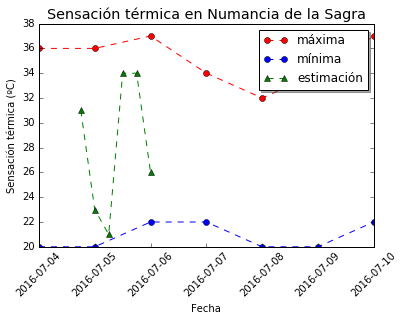

.. parsed-literal::

    Almacenado archivo Azután_2016-07-04.png

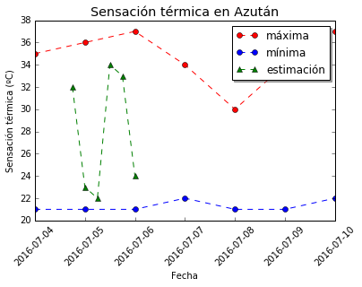

.. parsed-literal::

    Almacenado archivo Cebolla_2016-07-04.png

.. image:: Datos AEMET_files/Datos AEMET_7_33.png

.. parsed-literal::

    Almacenado archivo Yeles_2016-07-04.png

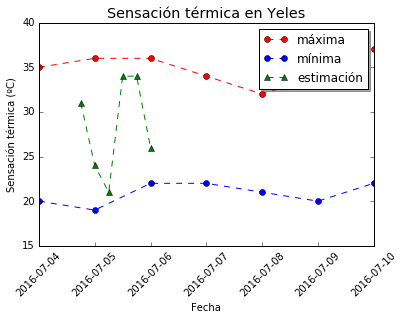

.. parsed-literal::

    Almacenado archivo Villamiel de Toledo_2016-07-04.png

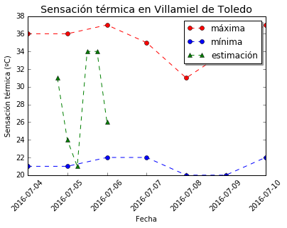

.. parsed-literal::

    Almacenado archivo El Puente del Arzobispo_2016-07-04.png

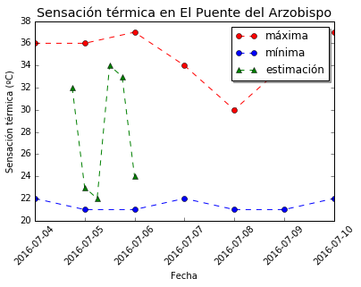

.. parsed-literal::

    Almacenado archivo Ciruelos_2016-07-04.png

.. parsed-literal::

    Almacenado archivo Yuncler_2016-07-04.png

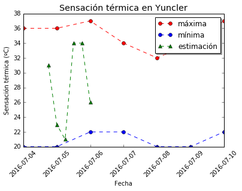

.. parsed-literal::

    Almacenado archivo Carriches_2016-07-04.png

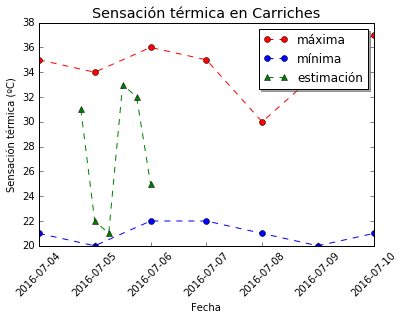

.. parsed-literal::

    Almacenado archivo Oropesa_2016-07-04.png

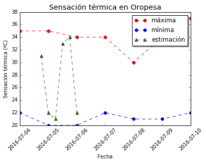

.. parsed-literal::

    Almacenado archivo Villaseca de la Sagra_2016-07-04.png

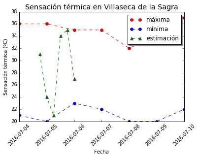

.. parsed-literal::

    Almacenado archivo Yunclillos_2016-07-04.png

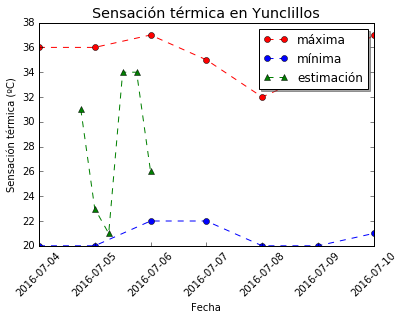

.. parsed-literal::

    Almacenado archivo Olías del Rey_2016-07-04.png

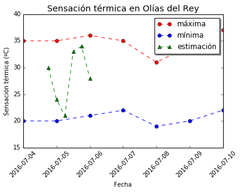

.. parsed-literal::

    Almacenado archivo Magán_2016-07-04.png

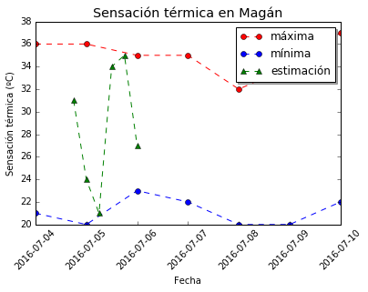

.. parsed-literal::

    Almacenado archivo Alcañizo_2016-07-04.png

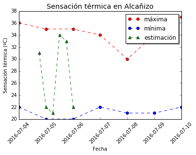

.. parsed-literal::

    Almacenado archivo Cabañas de la Sagra_2016-07-04.png

.. image:: Datos AEMET_files/Datos AEMET_7_59.png

.. parsed-literal::

    Almacenado archivo Villasequilla_2016-07-04.png

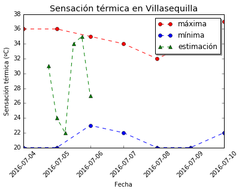

.. parsed-literal::

    Almacenado archivo Navalmoralejo_2016-07-04.png

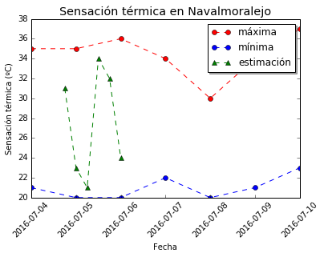

.. parsed-literal::

    Almacenado archivo Las Ventas de San Julián_2016-07-04.png

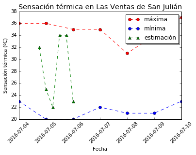

.. parsed-literal::

    Almacenado archivo Alameda de la Sagra_2016-07-04.png

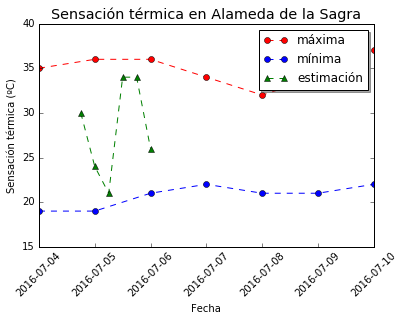

.. parsed-literal::

    Almacenado archivo Barcience_2016-07-04.png

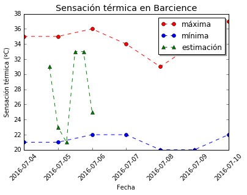

.. parsed-literal::

    Almacenado archivo Seseña_2016-07-04.png

.. image:: Datos AEMET_files/Datos AEMET_7_71.png

.. parsed-literal::

    Almacenado archivo Villaluenga de la Sagra_2016-07-04.png

.. parsed-literal::

    Almacenado archivo Calera y Chozas_2016-07-04.png

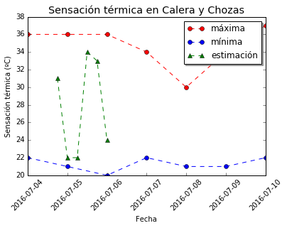

.. parsed-literal::

    Almacenado archivo Huerta de Valdecarábanos_2016-07-04.png

.. parsed-literal::

    Almacenado archivo Valdeverdeja_2016-07-04.png

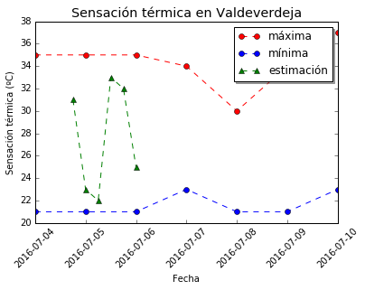

.. parsed-literal::

    Almacenado archivo Mocejón_2016-07-04.png

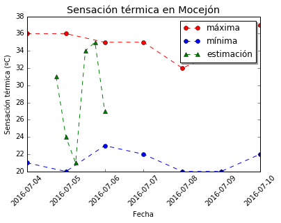

.. parsed-literal::

    Almacenado archivo Añover de Tajo_2016-07-04.png

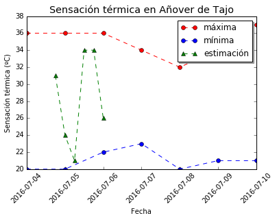

